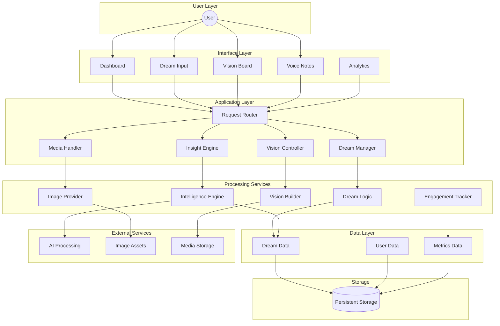
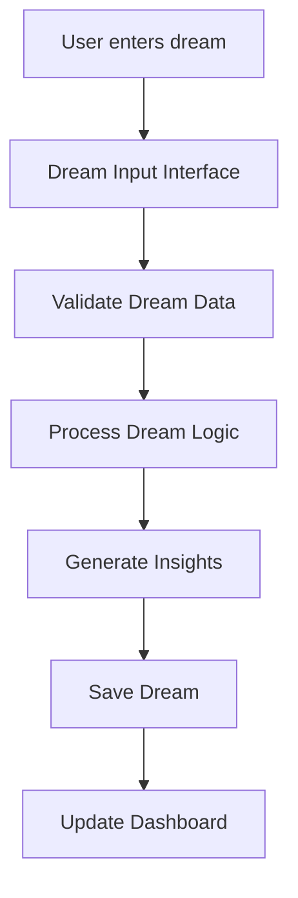
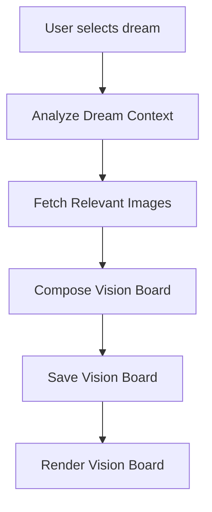
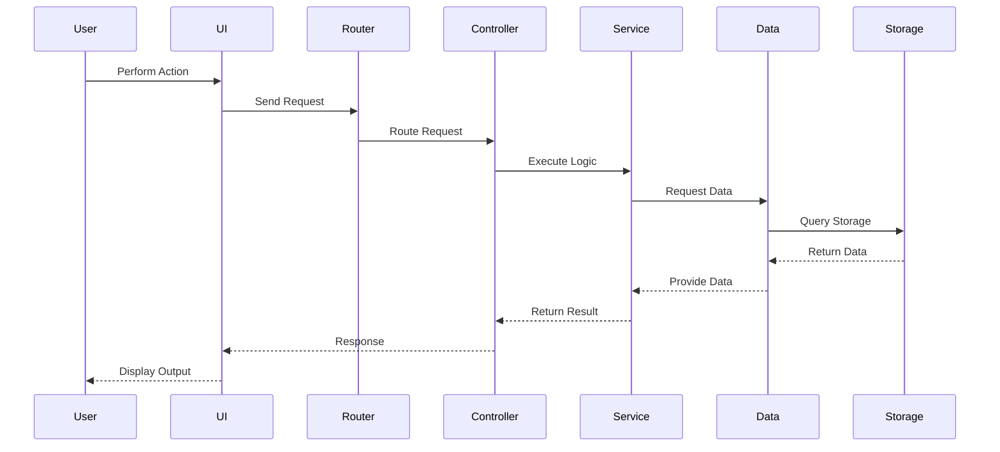

# DreamWeb

A platform for capturing dreams, visualizing goals, and tracking progress through intelligent insights and immersive vision boards.

---

# System Architecture

---

# Dream Creation Flow

---

# Vision Board Generation Flow

---

# System Request Lifecycle

